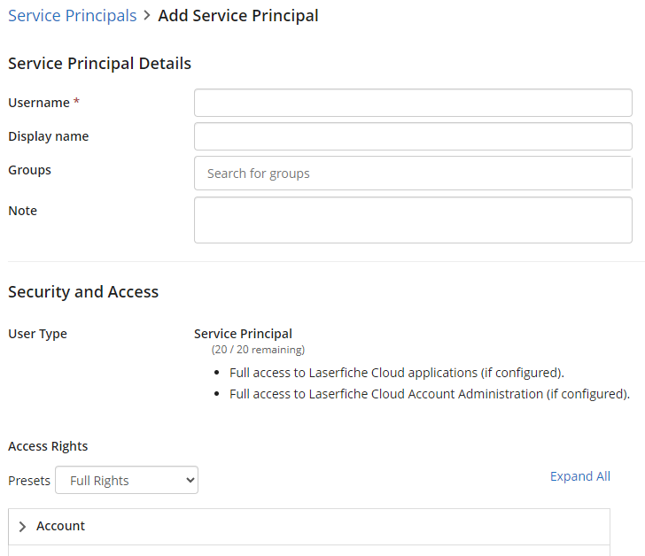
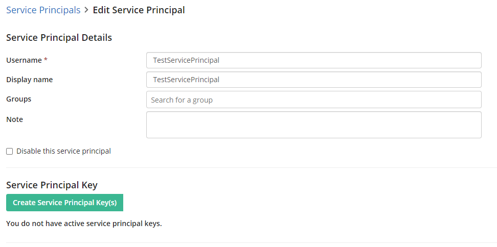
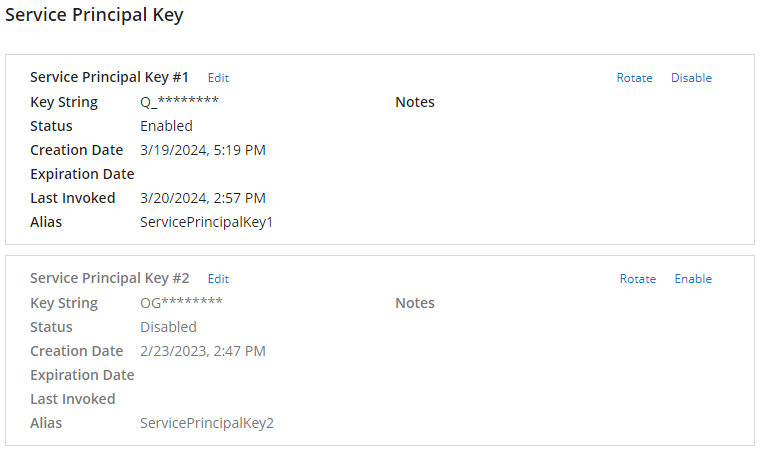

<!--© 2024 Laserfiche.
See LICENSE-DOCUMENTATION and LICENSE-CODE in the project root for license information.-->

# Service Principals

{: .note }
**Note:** The following guide only applies to Laserfiche Cloud.

Service Principals are a trustee license type designed specifically for non-human users to leverage the Laserfiche API.

## Benefits of Using a Service Principal

- Service Principals can perform work in Laserfiche services as a non-human user for integration use cases involving syncing data between Laserfiche and another platform.
  - Example use case: Your organization stores customer data in a CRM platform and leverages the Laserfiche repository for archival of documents related to each customer. People within your organization may update information in the CRM platform throughout the day. In order to keep the information in the Laserfiche Repository up to date with the changes made in the CRM, you write an integration that performs a nightly sync between the two platforms. This nightly operation is not an action performed by a specific human user in your organization. It is a "system-to-system" integration between Laserfiche and the CRM platform. This is a perfect scenario to use a Service Principal in the integration code to authenticate to the Laserfiche Repository and perform the sync.
- Service Principals can perform work in Laserfiche services on behalf of end users of an integration who may or may not have Laserfiche licenses.
  - Example use case: Your Accounts Payable department uses an ERP system to manage accounting transactions. The invoices for these transactions are stored in the Laserfiche repository. When end users of the ERP software create a new transaction, your integration code can authenticate as a Service Principal and import the invoice into the Laserfiche Repository behind the scenes. The end user may not know that the import happened, and Laserfiche doesn't know that the end user exists either. The Service Principal did the work of the import on behalf of the end user. Note in this situation, there is no granular security or auditability on each individual end user. Every action in the repository is recorded as the Service Principal.
- Service Principals can't cover every integration scenario. Often times you will want end users to authenticate to your integration code using their own Laserfiche credentials to leverage the full power of security and auditability. The best way to achieve this is through the OAuth 2.0 standard.

## Service Principal Limitations

Service Principal users can't authenticate to Laserfiche Cloud through the sign-in page UI. In other words, real human users can't use a Service Principal to sign in to any of the Laserfiche client applications such as the web client. Service Principals credentials are only valid when used programmatically through the Laserfiche API.

## Configuring Service Principal Users

Check out the steps below to learn how to create a Service Principal, maintain its keys, and administer securitiy.

### Creating a Service Principal User

1. In the Account Administration page, navigate to the Users tab. On the far right, there will be a subsection labeled Service Principals. 

1. Click "Add Service Principal". Like any other regular user type, you can assign the username for the Service Principal, give it a friendly display name, and add it to any existing Laserfiche Groups. You may also assign Access Rights to the Service principal. Be sure to give the Service Principal access to the Laserfiche services if you intend to use it with the Laserfiche API. 
1. When you're done, click Create to save your changes.

### Generating Keys

Rather than user-generated passwords, Service Principals have Service Principal Keys that Laserfiche cryptographically generates for you.

1. After you've created the Service Principal, click back into the user and note the "Create Service Principal Key(s)" button. Create the keys.
1. A dialog will pop up with the option to save a text file of the keys or copy them to your clipboard. Note that this is the only time you will be able to view these key values, so keep them in a safe place.

### Rotating Keys

A Service Principal can have two keys at any given time. Either of the keys may be used as the password to authenticate as the Service Principal, so long as the key is active.

1. To regenerate a new key, click the "Rotate" action for the desired key that you want to rotate. 

    {: .note }
    Note: Two keys are given to a Service Principal in order to seamlessly rotate a Principal's credentials without any down time. For instance, let's say your Service Principal is powering an integration in the production environment using Key #1. In order to follow security best practices, you'd like to rotate the password of the Principal. You may replace the Principal's credentials in your integration code with Key #2. You can then go back and disable Key #1. The next time you want to rotate the Principal's key, you can regenerate a new key for Key #1 using the Rotate action.

1.  By default, Service Principal keys will expire after 90 days. You can change this behavior under the Settings tab of Account Administration, on the Integration Configuration subsection 

### Applying Security

**Repository API**

Just like any other trustee type, you will be able to assign specific security to Service Principal users. They will appear in the user listing in Repository Administration as well as any user picker when assigning repository entry access rights.
