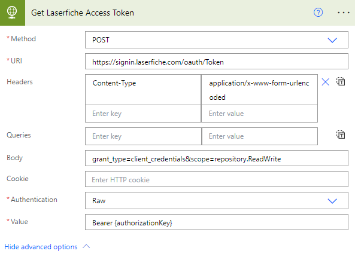
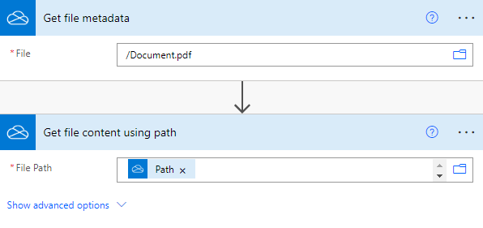
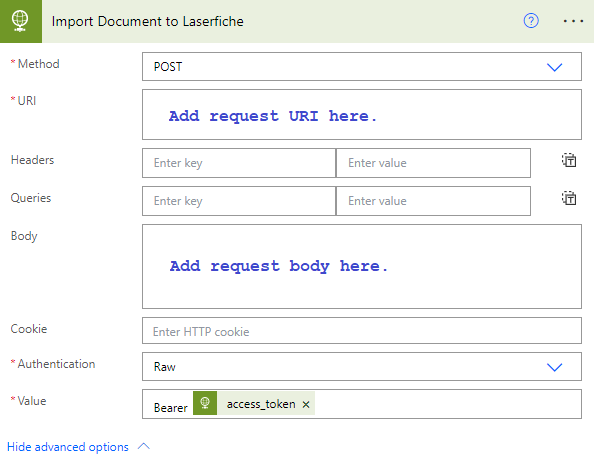

<!--© 2024 Laserfiche.
See LICENSE-DOCUMENTATION and LICENSE-CODE in the project root for license information.-->

# Using the Laserfiche API with Low-Code Tools
**Applies to**: Repository API v2.
<br/>
<sup>[See Repository API v1](../guide_low-code-tools-v1/).</sup>

Use the Laserfiche API to access Laserfiche from low-code tools. This guide will demonstrate how to import a document into Laserfiche with Microsoft Power Automate. Other low-code tools may follow a similar model.

## Authentication

HTTP Requests to the Laserfiche API will require an Access Token for authentication.

### Laserfiche Cloud

{: .note }
**Note:** The following section only applies to Laserfiche Cloud.

The Laserfiche Cloud APIs follows the [OAuth 2.0 authorization model](../../api/authentication/guide_authenticate-to-the-laserfiche-api/). A low-code solution must first be registered in the Developer Console as an OAuth Service App.

1. Follow [this guide](../../api/authentication/guide_oauth-service) to register an OAuth service app in the Developer Console with a long-lasting Authorization Key.

1. Create an HTTP action in your low-code solution to obtain an Access Token given a long-lasting `{authorizationKey}`obtained during the application registration.

```xml
POST https://signin.laserfiche.com/oauth/token
Authorization: Bearer {authorizationKey}
Content-Type: application/x-www-form-urlencoded
grant_type=client_credentials&scope=repository.ReadWrite
```

- The hostname in the request URI may need to be updated to `signin.laserfiche.ca`, `signin.eu.laserfiche.com`, etc., depending on the data center your Laserfiche Cloud repository resides in.
  For example in Microsoft Power Automate, the **Get Laserfiche Access Token** action will look like:
  

1. A successful response will contain the Access Token needed to make Laserfiche API requests.

```xml
HTTP 200 OK
{
  "access_token": "...",
  "token_type": "bearer",
  "expires_in": 43200,
  "scope": "repository.Read repository.Write"
}
```

1. The Access Token obtained from the **Get Laserfiche Access Token** action can then be used by downstream HTTP actions that interact with the Laserfiche APIs. For example, [import a document using a low-code tool](#use-case-importing-a-document-from-microsoft-onedrive-into-laserfiche-using-microsoft-power-automate).

{: .note }
**Note:** Authorization Keys and Access Tokens should be securely stored.

## Use Case: Importing a Document from Microsoft OneDrive into Laserfiche using Microsoft Power Automate

Prerequisite: obtain an Access Token. See [Authentication](#authentication).

See the [this guide](../../guides/documents-and-folders/guide_importing-documents) for more details on the Laserfiche import APIs.

1. In Microsoft Power Automate, create a OneDrive **Get file metadata** action and select a document to import into Laserfiche.
1. Link a OneDrive **Get file content using path** action and set the file path to the **Path** from the **Get file metadata** action.
   
1. Link an HTTP action to import the document into Laserfiche and assign a template and two fields. 

- The request **URI** is `https://api.laserfiche.com/repository/v2/Repositories/{repositoryId}/Entries/{parentFolderId}/Folder/Import`. The hostname may need to be updated to `api.laserfiche.ca`, `api.eu.laserfiche.com`, etc., depending on the data center your Laserfiche Cloud repository resides in, where:
  - `{repositoryId}` is your Laserfiche repository ID.
  - `{parentFolderId}` is the Laserfiche entry ID of the folder the document will be imported to.
  - `{documentName}` is the name of the document when imported to the Laserfiche repository.
- The Access Token from the **Get Laserfiche Access Token** [action](#authentication) must be added to the Authorization header.
  Format the Authorization header value as follows `Bearer @{body('Get_Laserfiche_Access_Token')['access_token']}`.
- The request **body** is a multipart/form-data with two parts.

  - The first part contains the file content from the **Get file content using path** action.

    {: .note }
    **Note:** The `Content-Type` header or the extension in the filename in the `Content-Disposition` header is used to determine the file type for the document imported to Laserfiche.

    - As an example, the second part assigns the `Email` template and the `Sender` and `Recipients` fields to the imported file. The metadata may need to be updated if the template and field definitions do not exist in the Laserfiche repository. - `{documentName}` is the name of the document when imported to the Laserfiche repository. - `autoRename` indicates if the imported entry should be automatically renamed if an entry already exists with the given name in the folder. The default value is false.
      Copy and paste the following request body.

  ```xml
  {
    "$content-type": "multipart/form-data",
    "$multipart": [
      {
        "headers": {
          "Content-Disposition": "form-data; name=\"electronicDocument\"; filename=@{outputs('Get_file_metadata')?['body/Name']}",
          "Content-Transfer-Encoding": "binary"
        },
        "body": @{body('Get_file_content_using_path')}
      },
      {
        "headers": {
          "Content-Disposition": "form-data; name=\"request\"",
          "Content-Transfer-Encoding": "binary"
        },
        "body": {
          "name": "{documentName}",
          "autoRename": true,
          "metadata": {
            "templateName": "Email",
            "fields": [
              {
                "name": "Sender",
                "values": [
                  "sender@laserfiche.com"
                ]
              },
              {
                "name": "Recipients",
                "values": [
                  "recipient@laserfiche.com"
                ]
              }
            ]
          }
        }
      }
    ]
  }
  ```

A successful call will return a 201 HTTP response status code with the details of the created entry in the response body. In addition, the URI for the created entry is returned in the _location_ HTTP response header. In the following example response, _{documentName}_ has been set to _"LFAPI created document"_.

```xml
HTTP 201 Created
{
  "@odata.context": "https://api.laserfiche.com/repository/v2/$metadata#Entries/Laserfiche.Repository.Document/$entity",
  "@odata.type": "#Laserfiche.Repository.Document",
  "id": 2161949,
  "isContainer": false,
  "isLeaf": true,
  "name": "LFAPI created document",
  "parentId": 557841,
  "fullPath": "\\LFAPI created document",
  "folderPath": "\\",
  "creator": "Guide User",
  "creationTime": "2023-09-06T14:52:18Z",
  "lastModifiedTime": "2023-09-06T14:52:23Z",
  "entryType": "Document",
  "templateName": "Email",
  "templateId": 9865,
  "templateFieldNames": [
    "Sender",
    "Recipients"
  ],
  "volumeName": "CLOUD",
  "electronicDocumentSize": 63369,
  "extension": "pdf",
  "isElectronicDocument": true,
  "isRecord": false,
  "mimeType": "application/pdf",
  "pageCount": 7,
  "isCheckedOut": false,
  "isUnderVersionControl": false
}
```

## Next Steps

- Check out additional [Guides](../../guides/) for more walk-throughs and tutorials about the Laserfiche API.
