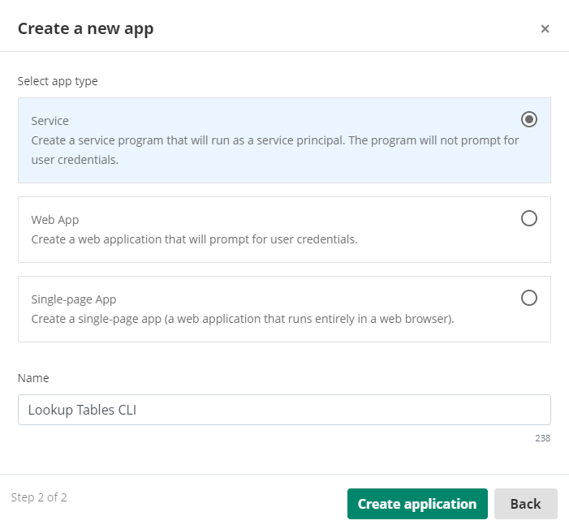

<!--© 2024 Laserfiche.
See LICENSE-DOCUMENTATION and LICENSE-CODE in the project root for license information.-->

# Using the Lookup Tables CLI For Laserfiche Cloud

## Overview

LookupTables command line utility is an executable available for Windows and Linux with the following capabilities:

- List Lookup Tables names.
- Query a Lookup Table and optionally saves the result in a CSV or JSON file.
- Replaces all the rows in a Lookup Table with the ones from a CSV or XLSX file. See [Lookup Tables documentation](https://doc.laserfiche.com/laserfiche.documentation/en-us/Default.htm#../Subsystems/ProcessAutomation/Content/Resources/Entities/lookup-tables.htm) for more information.

[Project link](https://github.com/Laserfiche/lf-lookup-tables-cli) in GitHub.

## Lookup Tables CLI Download And Installation

1. Download LookupTables CLI for your operating system:

   - [lookuptables-win-x64.zip](./lookuptables-win-x64.zip)
   - [lookuptables-linux-x64.zip](./lookuptables-linux-x64.zip)

1. Extract folder on target machine
1. On Linux, give `LookupTables` file execute permissions, for example

   ```sh
   sudo chmod 744 LookupTables   
   ```

## Enabling CLI access to Lookup Tables

Lookup Tables are configured in `Process Automation -> Data Management -> Lookup Tables` and belong to either `Global` or a specific Process Automation Project which defines the security scope. You can read more about Projects in Process Automation [here](https://doc.laserfiche.com/laserfiche.documentation/en-us/Default.htm#../Subsystems/ProcessAutomation/Content/Resources/Teams/projects.htm?TocPath=Process%2520Automation%257CTeams%257CProjects%257C_____0).

{: .note }
**Note:** Lookup Tables CLI uses the [OData Table API](./../../api/odata-api-reference/) which requires security scopes e.g. `project/Global` or `project/YourProjectName` and table access permission scopes such as `table.Read` and `table.Write` to be configured in the Service App.

### 1. Obtain a Service Principal Account and Keys

- Select an existing Service Principal account or create a new one. The service principal must have the Process Automation Administrator role in order to access global resources. See the [Table API security overview](./../../api/odata-api-reference/#security) for details on what roles the service principal must have if using resources within a project instead of global resources.
- In Account Administration, generate a Service Principal key for the account (record the key string, you'll need it later).

{: .note }
**Note:** The service principal must have Process Automation Administrator role in order to access global resources.

### 2. Create an App in the Laserfiche Developer Console

- Create or reuse a Service App and credentials to represent the integration with the Lookup Tables CLI tool.
  - Follow instructions [here](./../../api/authentication/guide_oauth-service/) on creating a Service App in the Laserfiche Developer Console and generating an access key. Use the service principal and service principal key that you generated in the previous step when generating your credentials.
  - Determine what process automation scopes you will need by reviewing the [Table API security overview](./../../api/odata-api-reference/#security). These scopes will need to be configured in developer console and used when generating your username/password.

**The following screenshots show how to generate a username/password to access global resources:**

   1. Create Service App in Developer Console

      {: width="500" }

   1. Configure OAuth Scopes for Service App in the Authentication tab

      {: width="800"}

   1. Create Access Key for Service App: Select 'Access Key' and download as 'base-64 string'

      {: width="500"}

   1. Store the 'Service Principal key' and the 'base-64 string' securely. These strings represent the credentials required by the Lookup Tables CLI tool. See [Usage examples](#usage-examples).

## Usage examples

### Show help and usage information

Windows:

```sh
.\LookupTables.exe -?
```

Linux:

```sh
./LookupTables -?
```

### List all the lookup tables in the Global context

```sh
./LookupTables.exe list-lookup-tables  --project-scope "project/Global"  --service-principal-key "<ENTER Service Principal Key>" --access-key-base64string "<ENTER base-64 Access Key string>"
```
