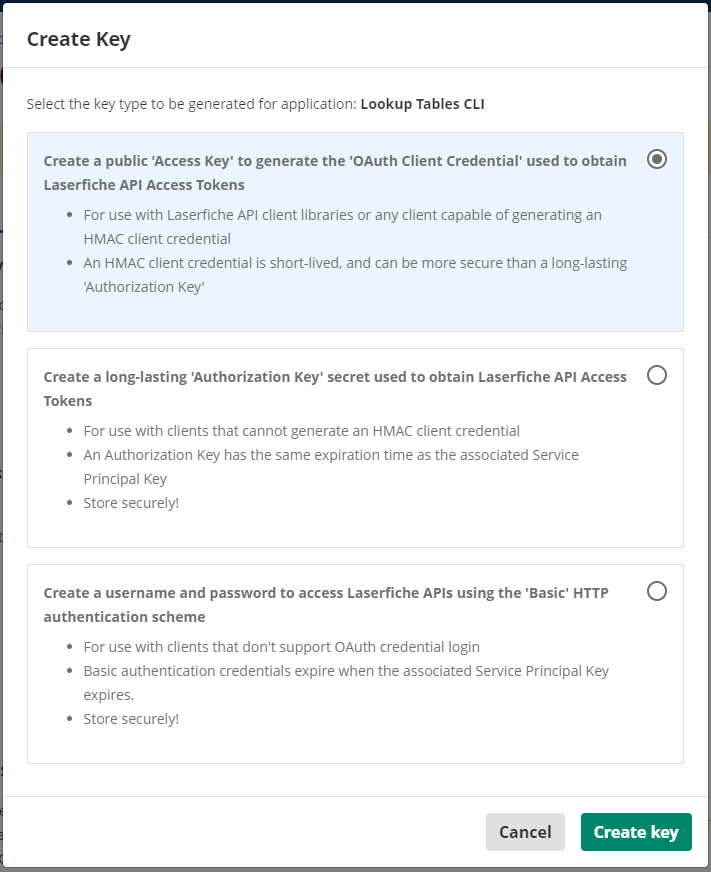

<!--© 2024 Laserfiche.
See LICENSE-DOCUMENTATION and LICENSE-CODE in the project root for license information.-->

# Using the Lookup Tables CLI For Laserfiche Cloud

## Overview

LookupTables command line utility is an executable available for Windows and Linux with the following capabilities:

- Listing Lookup Tables names.
- Querying a Lookup Table and optionally saving the result in a CSV or JSON file.
- Replacing all the rows in a Lookup Table with the ones from a CSV or XLSX file. See [Lookup Tables documentation](https://doc.laserfiche.com/laserfiche.documentation/en-us/Default.htm#../Subsystems/ProcessAutomation/Content/Resources/Entities/lookup-tables.htm) for more information.

[Project link](https://github.com/Laserfiche/lf-lookup-tables-cli) in GitHub.

## Lookup Tables CLI Download And Installation

- Download LookupTables CLI for your operating system:

   - [lookuptables-win-x64.zip](./lookuptables-win-x64.zip)
   - [lookuptables-linux-x64.zip](./lookuptables-linux-x64.zip)

- Extract folder on target machine
- On Linux, give `LookupTables` file execute permissions, for example

   ```sh
   sudo chmod 744 LookupTables   
   ```

## Enabling CLI access to Lookup Tables

Lookup Tables are configured in `Laserfiche Cloud -> Process Automation -> Data Management -> Lookup Tables` and belong to either `Global` or a specific Process Automation Project which defines the security scope. You can read more about Projects in Process Automation [here](https://doc.laserfiche.com/laserfiche.documentation/en-us/Default.htm#../Subsystems/ProcessAutomation/Content/Resources/Teams/projects.htm?TocPath=Process%2520Automation%257CTeams%257CProjects%257C_____0).

{: .note }
**Note:** Lookup Tables CLI uses the [OData Table API](./../../api/odata-api-reference/) which requires security scopes e.g. `project/Global` or `project/YourProjectName` and table access permission scopes such as `table.Read` and `table.Write` to be configured in a Service App in the Developer Console.

### 1. Obtain a Service Principal Account to configure your Service App

- In Account Administration, select an existing Service Principal account or create a new one. The service principal must have the `Process Automation Administrator` role in order to access resources in the Global scope. Service Principal may require additional roles to access resources within specific projects. See the [Table API security overview](./../../api/odata-api-reference/#security).
- Generate a Service Principal key for the account (record the key string, you'll need it later).

{: .note }
**Note:** The Service Principal must have Process Automation Administrator role in order to access global resources.

### 2. Create a Service App in the Developer Console to enable access from Lookup Tables CLI tool

- Create a Service App by importing [Lookup Tables CLI App Manifest.json](./assets/Lookup%20Tables%20CLI%20App%20Manifest.json) manifest file. See [creating an App from a manifest file](../../api/authentication/guide_importing-exporting-manifest/#create-an-application-from-a-manifest) for details.
  - Optionally create a Service App following instructions [here](./../../api/authentication/guide_oauth-service/).

### 3. Configure the App security settings and generate the Access Key

- In the App configuration page, select the Service Principal configured in step 1.
- Determine what process automation scopes you will need by reviewing the [Table API security overview](./../../api/odata-api-reference/#security). Configure OAuth Scopes for the Service App in the Authentication tab.

{: .note }
**Note:** Select at least one project in `Project Scopes`.

   {: width="1000"}

### 4. Generate App Access Key

- Create Access Key for the Service App: Select 'Access Key' and download as 'base-64 string'

   {: width="500"}

- Store the 'Service Principal key' and the 'base-64 Access Key' securely. These strings represent the credentials required by the Lookup Tables CLI tool. See [Usage examples](#usage-examples).

## Passing credentials to CLI tool

- Option 1: Pass the 'Service Principal key' and the 'base-64 Access Key' as command line parameters.
- Option 2: Store credentials in a file named `.env` and place it in the same folder as `LookupTables` executable. File format:

   ```sh
   AUTHORIZATION_TYPE="CLOUD_ACCESS_KEY"
   SERVICE_PRINCIPAL_KEY="<Service Principal Key created from step 1>"
   ACCESS_KEY="<base-64 Access Key string created from step 2>"
   ```

{: .note }
**Note:** The .env file contains secrets. Keep in a secure location.

## Lookup Tables CLI Usage

### Show help and usage information

Windows:

```bat
.\LookupTables.exe -?
```

Linux:

```sh
./LookupTables -?
```

### List all the lookup tables in the Global context

```bat
.\LookupTables.exe list-lookup-tables  --project-scope "project/Global"  --service-principal-key "<ENTER Service Principal Key>" --access-key-base64string "<ENTER base-64 Access Key string>"
```
